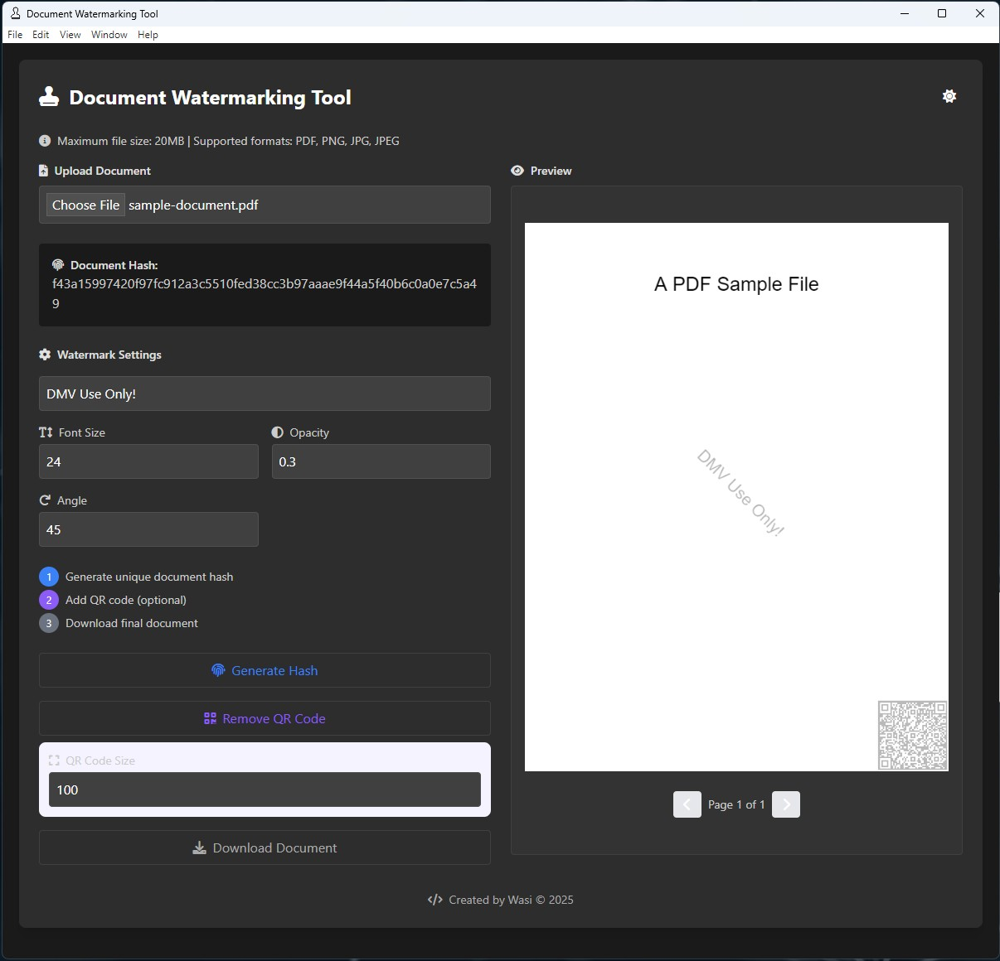

# Document-Watermark-Tool
This is a Windows-based portable document watermarking application addressing the rising threat of document fraud and identity theft while preserving user privacy. This tool offers a secure alternative to cloud-based services that often retain processed documents. The application processes documents entirely on the user's device and it supports PDF, PNG, JPG, and JPEG formats up to 20MB. Furthermore, it features customizable watermarking capabilities and advanced security measures, including SHA-256 hashing and QR code generation for each document. 

## Important Note

The binary file for this tool is not cryptographically signed, which may trigger "Publisher: Unknown" warnings on Windows. This is a standard security measure for unverified software.

To ensure the binary's integrity, I have provided its SHA256 hash. You can use this hash to verify that the binary has not been altered during download.
